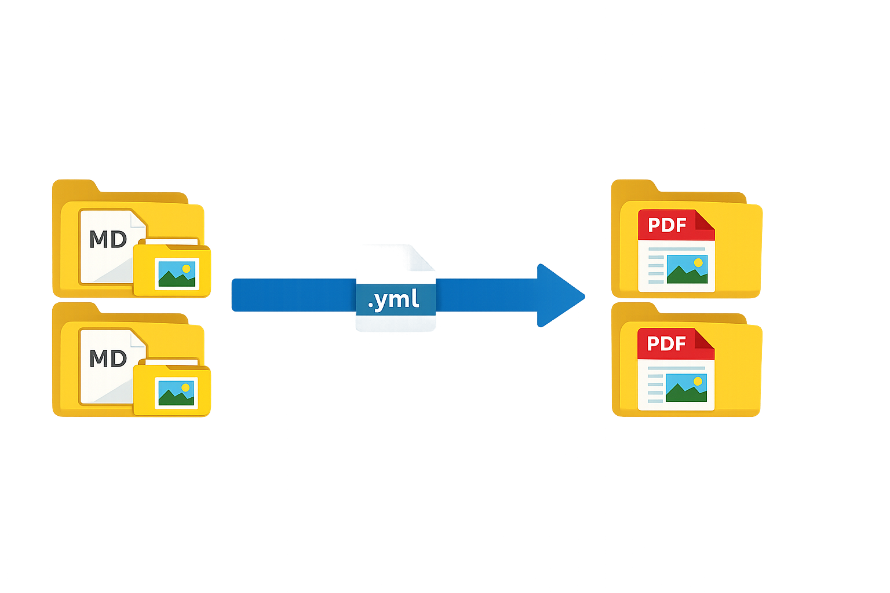

# Markdown to PDF



Converts a structured set of Markdown files into PDFs, preserving your folder layout, and zips them for easy distribution. Runs as a GitHub Action or locally via Node.js.

## How It Works

1. Recursively finds all `.md` files under `docs/` (or a configured directory)
2. Renders each file to HTML using `markdown-it`
3. Embeds any local images as base64 data URIs so PDFs are fully self-contained
4. Renders to PDF via headless Chromium (Playwright)
5. Mirrors the `docs/` folder structure in `dist-pdfs/`
6. Zips all PDFs into `markdown-pdfs.zip`

## Folder Structure

```
docs/
  topic/
    page/
      page.md
      imgs/
        screenshot.png   ← images live alongside their markdown file
dist-pdfs/
  topic/
    page/
      page.pdf           ← imgs/ folders are not mirrored; images are embedded in the PDF
scripts/mdpdf/
  build-pdfs.mjs         ← main entry point
  discover.mjs           ← finds all .md files recursively
  render-markdown.mjs    ← markdown → HTML
  resolve-assets.mjs     ← embeds local images as data URIs
  render-pdf.mjs         ← HTML → PDF via Playwright
  create-zip.mjs         ← zips dist-pdfs/
```

Images in `imgs/` folders are read at build time and embedded directly into the PDF. The `imgs/` folders themselves are not copied to `dist-pdfs/` — only the generated `.pdf` files appear in the output.

## Local Usage

**Prerequisites:** Node.js v18+, npm

```sh
npm install
npm run build
```

Outputs PDFs to `dist-pdfs/` and creates `markdown-pdfs.zip`.

### Adding Documentation

Place `.md` files anywhere under `docs/`. Put images in an `imgs/` subfolder next to the markdown file and reference them with a relative path:

```markdown

```

Remote images (`https://`) are left as-is; local images are embedded automatically.

## GitHub Action Usage

```yaml
name: Convert Markdown to PDFs

on:
  push:
    paths:
      - 'docs/**'
  workflow_dispatch:

jobs:
  markdown-to-pdf:
    runs-on: ubuntu-latest
    steps:
      - name: Checkout repository
        uses: actions/checkout@v6
      - name: Convert Markdown to PDFs
        uses: masautt/markdown-to-pdf@v1
        with:
          docs_dir: docs       # optional, default: docs
          out_dir: dist-pdfs   # optional, default: dist-pdfs
```

The generated PDFs and zip are uploaded as workflow artifacts.

## Customization

Print styles (margins, fonts, page size) can be edited in `scripts/mdpdf/render-pdf.mjs`.

## Troubleshooting

- If a Markdown file references a missing local image, the build fails and reports the exact path.
- A full success/failure summary is printed after every build.

## License

MIT
